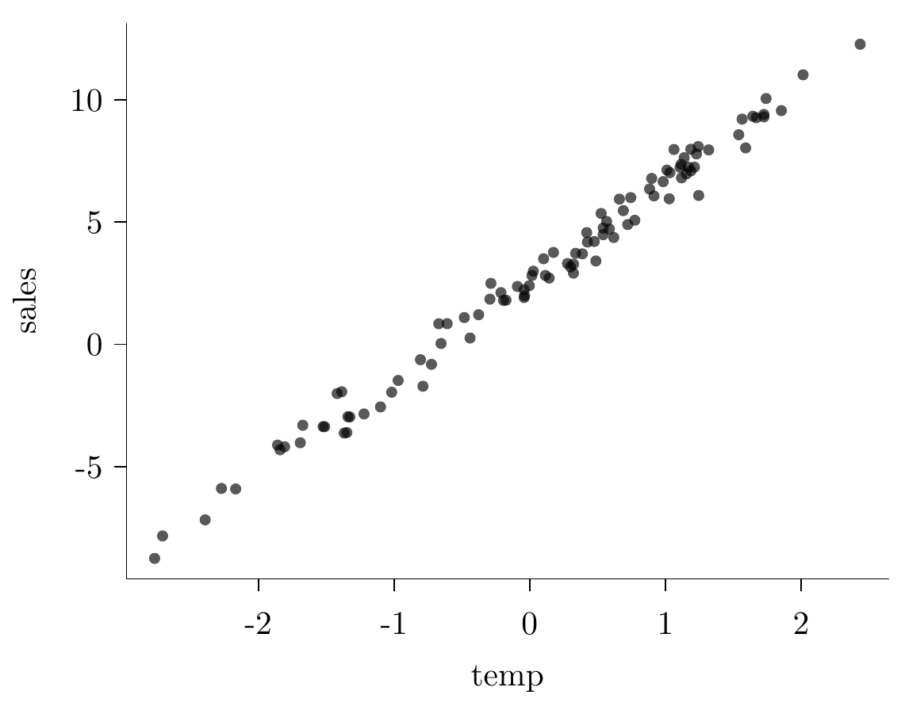
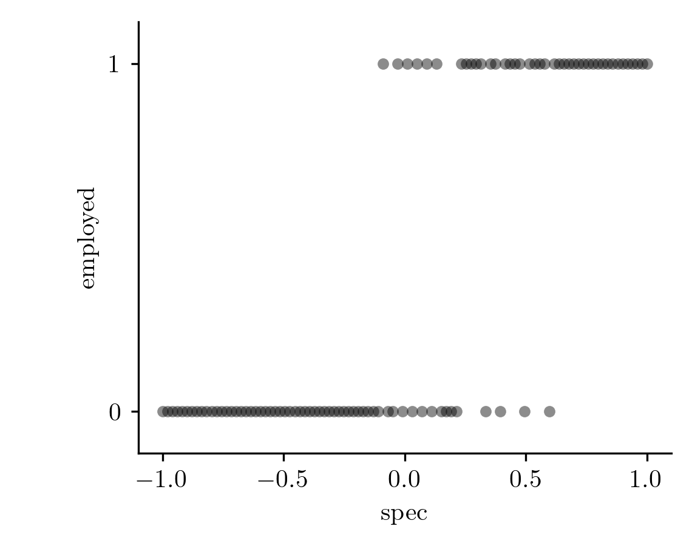
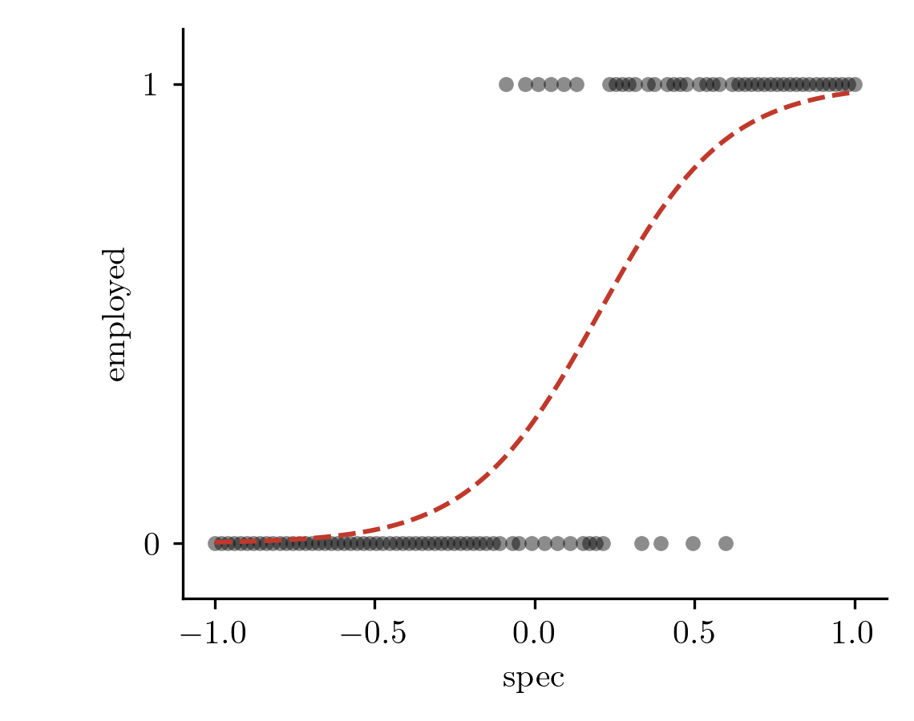
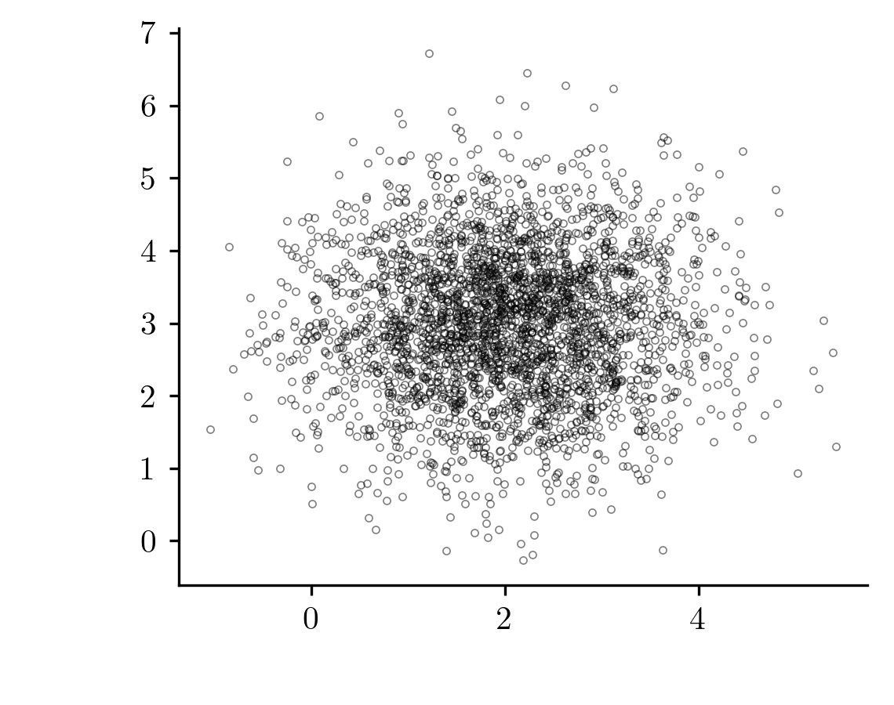

# 1. 강의영상



# 2. 네임드분포

`-` 확률분포표로 정의되는 $P$는 데이터를 만들어내는 규칙을 의미한다고 볼 수 있다. 

- $P$는 진실공간의 정보이다. 
- $P$는 종종 추정의 대상이 되기도 한다.
- $P$는 "데이터를 만드는 방법을 정리한 정보" 라고 해석할 수 있다. 
- $P$는 $X$가 가질수 있는 값의 범위를 정의한다는 (놓치기 쉬운) 사실도 주목하자. 예를들어 아래의 표와 같은 $P(X=x)$는 $X$가 가질 수 있는 값이 0과 1임을 의미한다.
 
|$x$| 0 | 1 |
|:--:|:--:|:--:|
|$P(X=x)$| $1-\theta$ | $\theta$ |


<br/> d
`-` $P$를 정의하는 방식은 매우 다양하다. 예를들어 아래와 같은 확률분포표를 고려하자. 

|$x$| 0 | -1 | 1023 | 
|:--:|:--:|:--:|:--:|
|$P(X=x)$| 0.5 | 0.2 | 0.3 | 

이것은 시행을 해서 얻은 결과가 0일 확률이 0.5이고 -1일 확률이 0.2이고 1023일 확률이 0.3이라는 의미이다. 

`-` 일부의 $P$는 사람들이 자주 애용하는 편인데 그런 경우 이름을 붙이는 것이 편리하다는 생각을 하였다. 예를들어 아래와 같은 분포는 사람들이 관심이 있는 편인데 

|$x$| 0 | 1 | 
|:--:|:--:|:--:|
|$P(X=x)$| 0.5 | 0.5 | 

이러한 분포는 사람들이 베르누이라고 부른다. 

`-` 아래와 같은 분포도 사람들이 종종 관심이 있다. (공평한 동전을 두번던져서 앞면이 몇번나오는지를 세면 된다)

|$x$| 0 | 1 | 2 | 
|:--:|:--:|:--:|:--:|
|$P(X=x)$| 0.25 | 0.5 | 0.25 |  

따라서 이러한 분포에도 이름이 붙어있는데 이것을 이항분포라고 한다. 

`-` 아래와 같은 분포도 이항분포라 부른다. (공평한 동전을 5번 던져서 앞면이 몇번 나오는지 세어본다고 상상하자)

|$x$| 0 | 1 | 2 | 3 | 4 | 5 | 
|:--:|:--:|:--:|:--:|:--:|:--:|:--:|
|$P(X=x)$| 0.03125 | 0.15625 | 0.3125 | 0.3125 | 0.15625 | 0.03125 |


`-` 네임드분포는 종종 한두개의 숫자로 특정지을 수 있다. 예를들어 베르누이 분포는 

|$x$| 0 | 1 | 
|:--:|:--:|:--:|
|$P(X=x)$| ??? | ??? | 

의 형태를 가지는데 $P(X=1)$에 대응하는 숫자만 특정한다면 나머지는 자동으로 정해진다. 

`-` 아래와 같은 분포는 

|$x$| 0 | 1 | 2 | 
|:--:|:--:|:--:|:--:
|$P(X=x)$| 0.25 | 0.5 | 0.25 |  

분포를 특정하기 위해 최소 2개의 숫자를 정해야할 것 처럼 보인다. 하지만 이항분포가 독립적인 베르누이 시행을 결합하여 얻은 결과란 사실을 캐치하면 이것 역시 하나의 숫자로 분포를 특정할 수 있음을 알게 된다. 

`-` 분포를 특정하는데 필요한 숫자를 모수라 한다. 일반적으로 모수는 $\theta$라는 기호를 사용한다. 그렇지만 모수가 특별한 의미를 가짐을 강조하면 $\theta$대신에 다른기호를 쓰기도 한다. (예를들면 $p$)

`-` 네임드분포를 잘 정의해두면 편리하다. 왜냐하면 
 

$$X \sim P_\theta$$
단, $P_\theta(X=x)$는 아래의 표와 같이 정의된다.
 
| $x$             | 0          | 1        |
| :-------------: | :--------: | :------: |
| $P_\theta(X=x)$ | $1-\theta$ | $\theta$ |

라고 정의해야 할 일을 $X \sim Bernoulli(\theta)$라고 간단히 정의할 수 있기 때문이다. 

# 3. 모델링

`-` 주어진 데이터를 관찰하며 "이 데이터는 이러이러한 규칙으로 만들어진 것 같아" 라고 생각하며 "데이터를 만드는 부분"을 역으로 상상하는 문제를 고려하자. 이처럼 데이터가 만들어지는 규칙을 전반적으로 상상하는 과정을 모델링이라고 한다. 예를들어 관측한 $n$개의 데이터가 정규분포에서 나왔다고 상상한다면 이는 아래와 같이 모델링을 한 것이다. 

$$X_1,\dots,X_n \sim N(\mu,\sigma^2)$$

모델링을 통해 상상한 규칙을 구체화하는 과정에서 어떠한 숫자들을 특정해야 한다면, 그걸 추정하고자 할텐데, 이러한 행위를 모수추정이라고 한다.


`# 예제 1` -- 아이스아메리카노 판매량

`-` 카페주인 박혜원씨는 온도와 아이스아메리카노 판매량을 아래와 같이 조사하였다. 

```
temp = (-2.7641, -2.7057, -2.3917, -2.2718, -2.1673, -1.8582, -1.8398, -1.8065,
        -1.6910, -1.6726, -1.5225, -1.5117, -1.4192, -1.3853, -1.3668, -1.3477,
        -1.3398, -1.3260, -1.2211, -1.0998, -1.0174, -0.9696, -0.8054, -0.7868,
        -0.7242, -0.6705, -0.6537, -0.6088, -0.4819, -0.4396, -0.3766, -0.2933,
        -0.2864, -0.2123, -0.1932, -0.1749, -0.0907, -0.0414, -0.0411, -0.0383,
        -0.0035,  0.0166,  0.0267,  0.1021,  0.1152,  0.1430,  0.1750,  0.2780,
         0.3008,  0.3221,  0.3226,  0.3384,  0.3879,  0.4200,  0.4250,  0.4756,
         0.4875,  0.5262,  0.5409,  0.5413,  0.5662,  0.5863,  0.6191,  0.6608,
         0.6898,  0.7222,  0.7443,  0.7741,  0.8831,  0.8990,  0.9154,  0.9832,
         1.0108,  1.0280,  1.0329,  1.0631,  1.1082,  1.1163,  1.1184,  1.1379,
         1.1549,  1.1694,  1.1871,  1.1872,  1.2140,  1.2289,  1.2417,  1.2452,
         1.3188,  1.5399,  1.5653,  1.5910,  1.6444,  1.6698,  1.7255,  1.7259,
         1.7416,  1.8544,  2.0144,  2.4352)
sales= (-8.7528, -7.8347, -7.1757, -5.8897, -5.9130, -4.1209, -4.3131, -4.1892,
        -4.0253, -3.3098, -3.3651, -3.3674, -2.0116, -1.9380, -3.6284, -3.6070,
        -2.9573, -2.9716, -2.8466, -2.5604, -1.9572, -1.4768, -0.6287, -1.7125,
        -0.8194,  0.8411,  0.0340,  0.8442,  1.0941,  0.2566,  1.2104,  1.8471,
         2.4904,  2.1141,  1.7935,  1.8044,  2.3660,  1.9115,  2.2285,  1.9903,
         2.3971,  2.8128,  2.9881,  3.4981,  2.8164,  2.7074,  3.7572,  3.3024,
         3.1624,  2.9085,  3.2794,  3.7200,  3.6997,  4.5673,  4.1811,  4.2020,
         3.4067,  5.3503,  4.4822,  4.7522,  5.0233,  4.7126,  4.3650,  5.9347,
         5.4652,  4.8948,  5.9982,  5.0711,  6.3486,  6.7835,  6.0660,  6.6519,
         7.1216,  5.9491,  7.0176,  7.9653,  7.2363,  7.3597,  6.8046,  7.6279,
         6.9700,  7.2392,  7.9761,  7.0902,  7.2431,  7.7843,  8.0832,  6.0844,
         7.9475,  8.5681,  9.2061,  8.0291,  9.3233,  9.2633,  9.3993,  9.2976,
        10.0482,  9.5539, 11.0175, 12.2671)
```

{width=75% fig-align="center"}

그리고 온도와 아이스아메리카노 판매랑이 어떠한 관계가 있다는 사실을 알았다. 구체적으로는  "온도가 높아질수록 (=날씨가 더울수록) 아이스아메리카노 판매량이 증가" 한다는 사실을 알게 되었다. 

`-` 사실 진실은 이러하다. 내가 $y_i = \text{sales}_i$, $x_i = \text{temp}_i$ 라고 생각하고 데이터를 만들었다.

$$y_i = 2.5 + 4 x_i + \epsilon_i, i=1,2,\dots,n$$

박혜원씨는 내가 데이터를 이렇게 만든걸 "모른다."

`-` 박혜원씨의 의심: 이 세상이 혹시 시뮬레이션 아니야??? 누군가(=최규빈)가 적당히 아래와 같이 만든거 아니야?? 

```R
n  <- 100
β₀ <- ??
β₁ <- ??
σ  <- ??

x <- sort(rnorm(n))
ε <- rnorm(n) * σ
y <- β₀ + β₁*x + ε

temp  <- x
sales <- y
```

`-` 박혜원씨의 전략: 앞으로 이 세상은 시뮬레이션이라고 가정하자. 즉 데이터가 이러한 방식으로 만들어 졌다고 "믿자". (질문: 아닐수도 있잖아요? // 답변: 상관없어요)

```R
n  <- 100
β₀ <- ??
β₁ <- ??
σ  <- ??

x <- sort(rnorm(n))
ε <- rnorm(n) * σ
y <- β₀ + β₁*x + ε

temp  <- x
sales <- y
```

그리고 저 모델(위의 코드형태)이 맞다는 전제하에 $\beta_0$, $\beta_1$을 적당한 값으로 추정하자. 

`-` 위와 같은 코드형태를 제시하는 과정을 모델링이라고 하고, 위 코드 형태에서 `??`의 특정 숫자까지 구체화하는 과정을 추정이라고 한다. 

`#`

`-` Note: 위의 코드형태를 가정한다는 것은 사실 아래의 수식을 가정한다는 것과 같은 말이다. 

$$y_i = \beta_0 + \beta_1 x_i+ \epsilon_i, \quad \epsilon_i \sim N(0,??)$$

따라서 박혜원씨는 사실 

$$y_i \sim N(\beta_0+\beta_1 x_i, ??)$$

의 꼴에서 모평균을 알고 싶은 상황이라 볼 수 있다. (??는 모르지만 알필요없다) 


::: {.callout-note title="수업시간필기" collapse="true"}
아래가 성립하듯이 

$X \sim N(0,??) \Rightarrow X+1 \sim N(1,??)$

아래도 성립한다. 

$\epsilon_i \sim N(0,??)  \Rightarrow \epsilon_i+\beta_0+\beta_1 x_i \sim N(\beta_0+\beta_1 x_i,??)$

이제 $y_i = \beta_0+\beta_1x_i + \epsilon_i$ 를 이용하면 

$y_i \sim N(\beta_0+\beta_1 x_i,??)$
:::


`# 예제2` -- 이것도 모델링

`-` 아래의 숫자들을 관찰하자.

```
-0.5310, 0.0524, -0.5686, -0.9011, 0.2527, 0.5910, 0.7869, 0.5020
```

`-` 이러한 숫자들을 보고 누군가는 아래와 같은 모형을 상상할 것이다.

$$X_1,\dots,X_8 \overset{i.i.d.}{\sim} U(a,b)$$


`-` 누군가는 아래와 같은 모형을 상상할 것이다.

$$X_1,\dots,X_8 \overset{i.i.d.}{\sim} N(\mu,\sigma^2)$$

`-` 사실 진실은 이러하다.

```R
set.seed(43052)
x <- runif(8, -1, 1)
```

따라서 $U(a,b)$ 을 상상한 쪽은 올바른 모델링을 한 것이고, $N(\mu,\sigma^2)$ 을 상상한 쪽은 잘못된 모델링을 한 것이다. 그래서 $U(a,b)$ 가 현실에서는 좀 더 쓸만한 모델이 된다. 

`#`

`-` 강의흐름과 약간 결이 다른 메시지: 사실 현실에서는 올바른 모델링이란 거의 불가능하다. 그래서 올바른 모델을 찾기위햇 노력하기 보다 쓸모있는 모델을 찾기 위한 노력하는 것이 더 의미있는 경우가 많다. 

> George Box: “All models are wrong, but some are useful.”

`# 예제3` -- 스펙과 취업

`-` 박혜원씨는 스펙과 취업이 어떠한 관계를 가지는지 알기 위하여 100명의 자료를 조사하였다. 

```
spec     = (-1.0000, -0.9798, -0.9596, -0.9394, -0.9192, -0.8990, -0.8788, -0.8586,
            -0.8384, -0.8182, -0.7980, -0.7778, -0.7576, -0.7374, -0.7172, -0.6970,
            -0.6768, -0.6566, -0.6364, -0.6162, -0.5960, -0.5758, -0.5556, -0.5354,
            -0.5152, -0.4949, -0.4747, -0.4545, -0.4343, -0.4141, -0.3939, -0.3737,
            -0.3535, -0.3333, -0.3131, -0.2929, -0.2727, -0.2525, -0.2323, -0.2121,
            -0.1919, -0.1717, -0.1515, -0.1313, -0.1111, -0.0909, -0.0707, -0.0505,
            -0.0303, -0.0101,  0.0101,  0.0303,  0.0505,  0.0707,  0.0909,  0.1111,
             0.1313,  0.1515,  0.1717,  0.1919,  0.2121,  0.2323,  0.2525,  0.2727,
             0.2929,  0.3131,  0.3333,  0.3535,  0.3737,  0.3939,  0.4141,  0.4343,
             0.4545,  0.4747,  0.4949,  0.5152,  0.5354,  0.5556,  0.5758,  0.5960,
             0.6162,  0.6364,  0.6566,  0.6768,  0.6970,  0.7172,  0.7374,  0.7576,
             0.7778,  0.7980,  0.8182,  0.8384,  0.8586,  0.8788,  0.8990,  0.9192,
             0.9394,  0.9596,  0.9798,  1.0000)
employed = (      0,       0,       0,       0,       0,       0,       0,       0,
                  0,       0,       0,       0,       0,       0,       0,       0,
                  0,       0,       0,       0,       0,       0,       0,       0,
                  0,       0,       0,       0,       0,       0,       0,       0,
                  0,       0,       0,       0,       0,       0,       0,       0,
                  0,       0,       0,       0,       0,       1,       0,       0,
                  1,       0,       1,       0,       1,       0,       1,       0,
                  1,       0,       0,       0,       0,       1,       1,       1,
                  1,       1,       0,       1,       1,       0,       1,       1,
                  1,       1,       0,       1,       1,       1,       1,       0,
                  1,       1,       1,       1,       1,       1,       1,       1,
                  1,       1,       1,       1,       1,       1,       1,       1,
                  1,       1,       1,       1)
```

{width=75% fig-align="center"}

`-`스펙과 취업도 어떠한 관계가 있다는 사실은 알 수 있다. 구체적으로는 "스펙이 높을수록 (=준비를 많이 했을수록) 취업할 확률이 증가" 한다는 사실을 알게되었다. 

  - 스펙이 낮은 쪽은 취업여부가 계속 0 이고, 높은 쪽은 계속 1 이다. 그 사이에는 0 과 1 이 섞인다. 

`-` 사실 진실은 이러하다. 내가 $y_i = \text{employed}_i$, $x_i = \text{spec}_i$ 라고 생각하고 데이터를 만들었다.

$$y_i \sim Bernoulli(\pi_i), \quad \pi_i = \frac{\exp(-1 + 5 x_i)}{1+\exp(-1 + 5 x_i)}, \quad i=1,2,\dots,n$$

{fig-align="center"}

빨간 점선이 $\pi_i$ 이다. 취업여부(데이터)는 0 과 1 뿐이지만 그것을 만들어내는 underlying function(진실)은 S자 모양의 빨간 곡선이다. (하지만 박혜원씨는 내가 데이터를 이렇게 만든걸 "모른다.")

`-` 박혜원씨의 의심: 이 세상도 혹시 시뮬레이션 아니야??? 누군가가 적당히 아래와 같이 만든거 아니야?? 

```R

x <- seq(-1, 1, length.out = 100)

β₀ <- ??
β₁ <- ??
π <- exp(β₀ + β₁*x) / (1 + exp(β₀ + β₁*x))

y <- rbinom(n, 1, π)

spec     <- x
employed <- y
```

`-` 박혜원씨의 전략: 앞으로 이 세상도 시뮬레이션이라고 가정하자. 즉 데이터가 위와 같은 코드에서 만들어 졌다고 믿자. 그리고 저 코드형태가 맞다는 전제하에 $\beta_0$, $\beta_1$을 적당한 값으로 추정하자. 

`-` 코드형태를 제시하는 과정을 모델링이라고 하고, 위 코드 형태에서 `??`의 특정 숫자까지 구체화하는 과정을 추정이라고 한다. 예제1 과 같다. 

`#`

`-` Note: 위의 코드형태를 가정한다는 것은 사실 아래의 수식을 가정한다는 것과 같은 말이다. 

$$y_i \sim Bernoulli(\pi_i), \quad \pi_i = \frac{\exp(\beta_0 + \beta_1 x_i)}{1+\exp(\beta_0 + \beta_1 x_i)}$$

따라서 박혜원씨는 사실 

$$y_i \sim Bernoulli \left(\frac{\exp(\beta_0 + \beta_1 x_i)}{1+\exp(\beta_0 + \beta_1 x_i)}\right)$$

의 꼴에서 모평균을 알고싶은 상황이라 볼 수 있다. 예제1 에서 $N(\beta_0+\beta_1x_i,??)$ 의 모평균을 알고싶어 했던 것과 같다. (베르누이의 평균은 $\pi_i$ 이다)
 

`-` Note: 예제1,2,3에서 소개된 모든 모델링을 뭉뚱그려서

$$Y \sim P_{\theta}$$
혹은

 $$X \sim P_{\theta}$$

라고 쓸 수도 있다. 

::: {.callout-note title="수업시간설명" collapse="true"}
`예제1`

$$P_\theta(y_i=y) = f_\theta(y), \quad f_\theta \text{는 평균 } \beta_0+\beta_1x_i \text{, 분산 } ?? \text{ 인 정규분포의 pdf}$$

이때 $\theta=(\beta_0,\beta_1)$ 이다.

`예제2`

누군가의 상상1: 
$$P_\theta(X_i=x) = f_\theta(x), \quad f_\theta \text{는 구간 } (a,b) \text{ 위의 균등분포의 pdf}$$

이때 $\theta=(a,b)$ 이다.

누군가의 상상2:
$$P_\theta(X_i=x) = f_\theta(x), \quad f_\theta \text{는 평균 } \mu \text{, 분산 } \sigma^2 \text{ 인 정규분포의 pdf}$$

이때 $\theta=(\mu, \sigma^2)$ 는 그 평균과 분산이다.

`예제3`

$$P_\theta(y_i=y) = \pi_i^{y}(1-\pi_i)^{1-y}, \quad \pi_i = \frac{\exp(\beta_0+\beta_1x_i)}{1+\exp(\beta_0+\beta_1x_i)}$$

이때 $\theta=(\beta_0,\beta_1)$ 이다.
:::

`-` $X \sim P_{\theta}$ 라고 표현한다는 것은 $\theta$라는 숫자만 알고 있다면 진실세계의 정보를 모두 특정할 수 있다는 것을 의미한다. 이러한 경우를 모수적 모델링(parametric modeling)이라고 부른다. (비모수적 모델링도 있음) 

`-` 통계학의 모든 이야기는 결국 모델링과 추정의 이야기이다. 피셔는 통계학의 목적을 "데이터로 부터 올바른 추정을 하는것"이라고 이야기 했다. 

`-` 사족

- 통계학에서 현실세계의 문제를 해결하는 방식은 "모델링 $\Rightarrow$ 추정" 의 패턴이 많다. 
- 대부분의 현실문제는 네임드분포 (베르누이분포, 정규분포,...) 만으로 가능한 경우가 많다. (사실 반대죠, 현실문제에 빈번하게 등장하는 분포가 네임드분포가 되는거죠) 
- 그래서 보통 통계학과는 (1) 네임드 분포를 외운다 (2) 그 네임드분포에서 추정을하는 방법을 배운다 순으로 교육과정이 구성되어 있다. 

# 4. 확률과 가능도 

`# 예제4` 

앞면이 나오는 확률을 알 수 없는 동전을 2번 던져서 아래와 같은 결과를 얻었다고 하자. 

- $x_1=0$
- $x_2=1$

앞면이 나오는 확률이 0.5였다고 생각하는 것이 타당한가? 아니면 앞면이 나오는 확률이 0.1이었다고 생각하는 것이 타당한가? 


(풀이)

$x_1=0,x_2=1$는 $Ber(\theta)$에서 얻은 실현치라고 가정하자. 만약에 $\theta=0.5$였다면 이러한 실현치를 얻을 확률은 아래와 같다. 

$$0.5 \times 0.5 = 0.25$$

만약에 $\theta=0.1$이었다면 이러한 실현치를 얻을 확률은 아래와 같다. 

$$0.9 \times 0.1 = 0.09$$

$0.25>0.09$ 이므로 $\theta=0.5$라고 생각하는 것이 더 타당해보인다. 

:::{.callout}

### 퀴즈

`1`. $x_1=0$, $x_2=1$은 진실세계의 정보인가? 아니면 데이터세계의 정보인가?

`2`. $\bar{x}=\frac{x_1+x_2}{2}=0.5$를 표현할 수 있는 용어는 (1) 표본평균 (2) 모평균 (3) 평균 

`3`. 문제를 보고 $X_1,X_2 \overset{iid}{\sim} Ber(\theta)$를 떠올렸다. 이러한 과정을 무엇이라고 하는가? 

`4`. $\theta$를 표현할 수 있는 용어는? (a) 모평균 (b) 표본평균 (c) 평균 (d) 모수 

`5`. $x_1,x_2$의 값을 바탕으로 $\theta$의 구체적인 값을 산정하는 과정을 무엇이라고 하나? (a) 추정 (b) 모수추정 (c) 모평균의 추정 
:::

`#`

`-` 질문: $0.25$를 $\theta=0.5$일 확률, $0.09$를 $\theta=0.1$일 확률로 해석하는건 어떨까? 타당한 용어일까?

`# 예제5` 

(예제4와 같은상황임) 앞면이 나오는 확률을 알 수 없는 동전을 2번 던져서 아래와 같은 결과를 얻었다고 하자. 

- $x_1=0$
- $x_2=1$

아래와 같은 용어가 성립가능할까? 

- $P(\theta=0.5)=0.5 \times 0.5 = 0.25$ 
- $P(\theta=0.1)=0.1 \times 0.9 = 0.09$ 

`(해설1)` 

성립한다고 치자. 그렇다면 아래와 같은 확률들도 정의할 수 있어야 한다. 

- $P(\theta=0.51)$, $P(\theta=0.52)$, $P(\theta=0.53)$, $P(\theta=0.54)$, $\dots$
- $P(\theta=0.49)$, $P(\theta=0.48)$, $P(\theta=0.47)$, $P(\theta=0.46)$, $\dots$

```r
print(0.51*0.49); print(0.52*0.48); print(0.53*0.47); print(0.54*0.46)
print(0.49*0.51); print(0.48*0.52); print(0.47*0.53); print(0.46*0.54)
```

```text
[1] 0.2499
[1] 0.2496
[1] 0.2491
[1] 0.2484
[1] 0.2499
[1] 0.2496
[1] 0.2491
[1] 0.2484
```

저 위의 숫자들을 모두 더하면 아래와 같음. 

```r
(0.2499 + 0.2496 + 0.2491 + 0.2484)*2
```
```text
[1] 1.994
```

1이 넘네? (모순) 따라서 확률이 아니다. 

`(해설2)` 

진실의 세계에서 데이터의 세계로 넘어갈때만 "확률"이라는 개념이 적용된다. 즉 확률은 반드시 아래와 같은 개념으로만 사용되어야 한다.

$$\text{진실의 세계} \overset{P}{\Longrightarrow} \text{데이터의 세계}$$

즉 우리는 $\theta=0.5$를 고정한뒤

$$P(X_1=x_1, X_2=x_2)=P(X_1=0, X_2=1)=0.25$$

라고 쓰는 것은 허용할 수 있지만 $x_1=0, x_2=1$을 고정한 뒤 

$$P(\theta=0.5)=0.25$$

라고 쓰는 건 허용할 수 없다. 

`(해설3)` 

확률은 반복가능한 대상에 대해서만 적용가능하다. 왜냐하면 확률은 상대빈도의 극한으로 해석해야 의미가 있기 때문이다. 예를들어 $x_1, x_2$은 반복적으로 관찰가능한 대상이므로 

$$P(X_1=x_1, X_2=x_2)$$

와 같은 표현은 성립한다. 예를들어 $P(X_1=0, X_2=1)=0.25$라는 의미는 아래와 같은 관측을 많이하면 대충 $x_1=0, x_2=1$이 나올 상대빈도가 $0.25$정도 된다는 뜻이다. 


```r
for(i in 1:10){
  print(rbinom(2, 1,0.5))
}
```
```text
[1] 0 1
[1] 1 1
[1] 0 1
[1] 0 1
[1] 1 1
[1] 1 0
[1] 1 1
[1] 0 1
[1] 1 0
[1] 1 0
```


그러나 아래와 같은 표현은 다르다. 

$$P(\theta=0.5)=0.25$$

이는 상대빈도의 극한으로 해석할 수 없다. $\theta=0.5$는 진실공간의 정보일뿐 반복관측가능한 대상이 아니다 (데이터공간의 정보가 아니다). 

> 빈도주의: 확률은 상대빈도의 극한으로 해석할 때 의미가 있다. $(\star\star\star)$

`#`

`#  Notation` -- $X_1,X_2 \overset{iid}{\sim} Ber(0.5)$ 일때 $P(X_1=x_1,X_2=x_2)$는 좀 더 명확하게 아래와 같이 쓸 수 있다.

$$P(X_1=x_1, X_2=x_2 | \theta= 0.5)$$

:::{.callout}

원래 $P$가 $\theta$에 의존함을 강조하고 싶을때는 "$P$" 대신에 "$P_{\theta}$"와 같이 쓰기도 한다고 했잖아요? 그 연장선에서

1. $P(X_1=0, X_2=1)$ 
2. $P_{\theta}(X_1=0, X_2=1)$

와 같은 표현은 사실 혼용해서 사용합니다. 만약에 $\theta=0.5$일 경우는 1은 그대로 $P(X_1=0, X_2=1)$로 쓰면되지만 2의 경우는 $P_{0.5}(X_1=0,X_2=1)$와 같이 쓰기 좀 어색하죠? 그래서 아래와 같이 사용합니다. 

- $P_{\theta}(X_1=0, X_2=1)$. 단, $\theta=0.5$.
- $P(X_1=0, X_2=1 | \theta = 0.5)$.

:::

`# 약속1` -- $X \sim P_{\theta}$ 일때 $P(X=x|\theta=\theta_0)$은 모수가 $\theta_0$ 라고 가정하였을 경우 관측치 $X=x$를 얻을 확률을 의미한다. 

`# 예제6` -- $X_1,X_2  \overset{iid}{\sim} Ber(\theta)$ 라고 할 때 아래를 풀어보자.

1. $P(X_1=0 ~|~ \theta=0.1)$
2. $P(X_1=0,X_2=1 ~|~ \theta=0.2)$
3. $P(X_1=0,X_2=1 ~|~ \theta=0.3)$
4. $P(X_1=0,X_2=1 ~|~ \theta=0.4)$
5. $P(X_1=1,X_2=0 ~|~ \theta=0.4)$
6. $P(X_1+X_2=0 ~|~ \theta=0.5)$
7. $P(X_1+X_2\geq 0 ~|~ \theta=0.5)$
8. $P(\max(X_1,X_2)=1 ~|~ \theta=0.5)$
9. $P(\bar{X}=\frac{1}{2} ~|~ \theta=0.5)$

`#`

`# 약속2` -- 연속확률변수 $X$의 확률밀도함수가 $f_X$라고 하자. $f_X(x|\theta=\theta_0)$이라는 의미는 모수가 $\theta_0$이라고 가정하였을 경우 $x$에서의 확률밀도함수값을 의미한다. 

`# 예제7` -- $X \sim N(\mu,\sigma^2)$ 라고 할때 아래를 풀어보자. (힌트: 정규분포의 pdf는 $f(x) = \frac{1}{\sigma\sqrt{2\pi}} e^{-\frac{(x-\mu)^2}{2\sigma^2}}$임.)

1. $f_X(0 | \mu=0, \sigma=1)$
2. $f_X(0 | \mu=1, \sigma=1)$
3. $f_X(0 | \mu=0, \sigma=2)$

`(풀이)`

손으로는 못푸니까 계산기를 이용합시다. 

```r
# 1번
mu=0;sigma=1; x=0; print(1/(sigma*sqrt(2*pi))*exp(-(x-mu)^2/(2*sigma^2)))
# 2번
mu=1;sigma=1; x=0; print(1/(sigma*sqrt(2*pi))*exp(-(x-mu)^2/(2*sigma^2)))
# 3번
mu=0;sigma=2; x=0; print(1/(sigma*sqrt(2*pi))*exp(-(x-mu)^2/(2*sigma^2)))
```

```text
[1] 0.3989423
[1] 0.2419707
[1] 0.1994711
```

`#`

`-` $X_1,X_2 \overset{iid}{\sim} Ber(\theta)$ 에서 관측한 관측치가 $x_1=0, x_2=1$ 이라고 하자. 

- $\theta=0.5$라면 이러한 관측치를 얻을 확률이 $0.25$이고 
- $\theta=0.1$라면 이러한 관측치를 얻을 확률이 $0.09$이다. 

그렇지만 이것이 

- $\theta=0.5$일 확률이 $0.25$이고 
- $\theta=0.1$일 확률이 $0.09$이라는 

의미는 아니다. 그런데 사실 "$\theta=0.5$라면 이러한 관측치를 얻을 확률이 $0.25$"라는 표현은 정확하긴 하지만 길고 복잡하다. 그래서 적당한 용어 `OOO`를 정의해서 

- $\theta=0.5$일 `OOO`가 $0.25$이고 
- $\theta=0.1$일 `OOO`가 $0.09$이고 

와 같이 표현하고 싶다. 여기에서 `OOO`에 해당하는 용어가 "가능도(likelihood)"이다. 가능도의 일반적인 정의는 아래와 같다. 

`정의1` -- 가능도와 가능도함수

가능도 $L(\theta|x)$는 관측된 데이터 $x$가 주어졌을 때, 모수 $\theta$의 그럴듯한 정도를 수치화 하여 측정한 것으로, 다음과 같이 정의된다:

- 이산형 확률변수: $L(\theta|x) = P(X=x|\theta)$ 
- 연속형 확률변수: $L(\theta|x) = f_X(x|\theta)$ 

여기에서 $L(\theta|x)$는 간단히 $L(\theta)$라고 표현하기도 하며 이를 $\theta$에 대한 가능도함수라고 한다. 

`-` 개인적의견: 흔히들 "가능도는 확률이 아니다" 라고 이야기하는데, 이게 어떤 의미로는 맞지만 어떤의미로는  맞지 않음. 가능도도 확률이다. 단지 "$\theta$일 확률" 이 아니라 "$\text{data}| \theta$" 일 확률일 뿐. (연속형인 경우는 확률이 아니라 확률밀도로 바꿔 읽으면 된다.)
 
`# 예제8`-- $X_1,X_2 \overset{iid}{\sim} Ber(\theta)$ 라고 하자. 

1. $L(0.5 | x_1=0, x_2=1)=???$
2. $L(0.3 | x_1=0, x_2=1)=???$
3. $L(0.5 | x_1+x_2=1)=???$
4. $L(0.5 | \bar{x}=0.5)=???$
5. $L(0.5 | \bar{x}=0.4)=???$
6. $L(0.5 | \bar{x}=0)=???$
7. $L(\theta | \bar{x}=0.5)=???$
8. $L(\theta | \bar{x}=0.4)=???$
9. $L(\theta | \bar{x}=0)=???$


`-` 가능도와 확률의 차이

1. 가능도는 총합이 1이라는 보장이 없다.(즉 $\int L(\theta|x) d\theta \neq 1$)
2. 가능도는 서로소인 집합 $A,B$에 대한 확률의 공리 $$P(A \cup B)=P(A)+P(B)$$가 성립하지 않는다. (가능도는 점 단위로만 정의가능하다)


`-` $X_1,X_2 \overset{iid}{\sim} Ber(\theta)$ 에서 관측치 $x_1=0, x_2=1$을 얻었다고 하자. 아래와 같은 표현은 불가능하다. 

- $L(\theta \in \{0.5, 0.49\}) = L(0.5) + L(0.49)$ 
- $L(\theta \in [0,1]) > L(0.5)$ 
- $L(\theta < 0) = 0$ 

`# 그 예제` -- 아래를 관찰하자. 

{width=75% fig-align="center"}

다음 중 그림을 아래와 같이 묘사했다고 하자. ($\sigma_x=\sigma_y=1$로 알려져있다고 가정하자.)

1. $x$축의 모평균은 2이다.
2. $y$축의 모평균은 3이다.
3. 모평균은 $(2,3)$이다. 
4. 모평균은 $(20,30)$이다. 
5. 모평균은 어딘가에 있다. 즉 평균은 $(x_0,y_0)$ 인데 $x_0 \in \mathbb{R}, y_0 \in \mathbb{R}$.

이는 아래와 같이 서술한것과 같다. 

1. $L(\mu_x=2,\mu_y \in \mathbb{R})$
2. $L(\mu_x\in \mathbb{R} ,\mu_y=3)$
3. $L(\mu_x=2,\mu_y=3)$
4. $L(\mu_x=20,\mu_y=30)$
5. $L(\mu_x\in \mathbb{R} ,\mu_y \in \mathbb{R})$ 

`#`